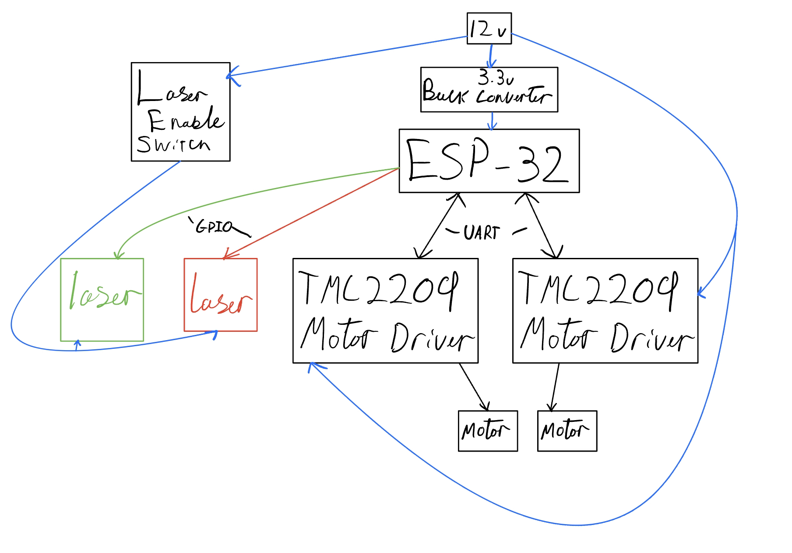

# ESP-32 Firmware

This is the PlatformIO project for the ESP-32 firmware.

Requirements:

- [ ] Control the stepper motors (with the TMC2209 drivers)
  - [ ] Allow the user to not use a limit switch
  - [ ] 
- [ ] Control the lasers
- [ ] Have a web interface to control everything
  - [ ] Use a websocket to communicate with the ESP-32
  - [ ] 

